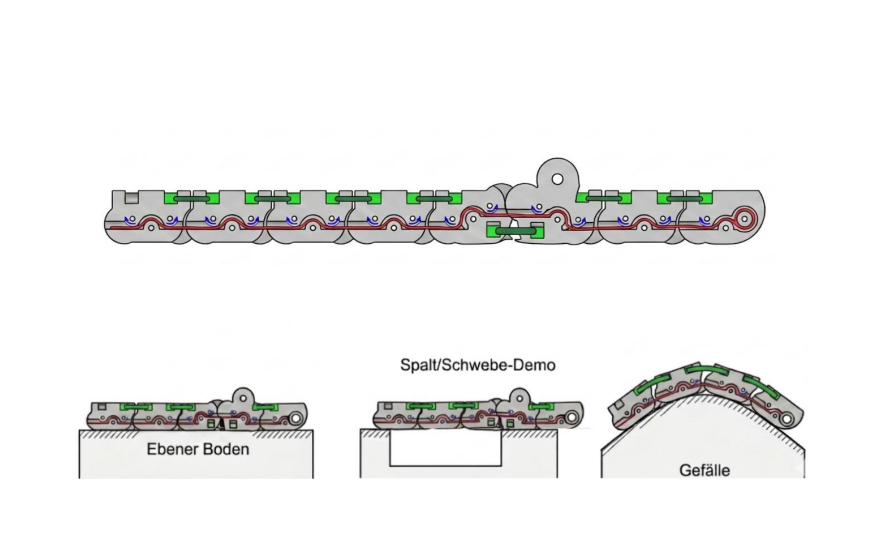

# Mittelfuß- und Fersenbein-Konstruktion

### Bauteil 1 („Metatarsal“)
Bauteil 1 („Metatarsal“) bildet die Schnittstelle zu den fünf Tensegrity-Zehensegmenten, die über eine M4-Achse/Schraube an sechs Aufhängungspunkten (je 4 mm Breite) verbunden sind. Es ist über eine M6-Zylinderkopfschraube mit Bauteil 2 verbunden (Senkung $\varnothing 10{,}2 \times 5\text{ mm}$ für den Schraubenkopf, polygonale M6-Mutternaufnahme SW $10{,}2\text{ mm}$ auf der Gegenseite). Der Achsabstand zwischen J2 (Zehen) und J3 (Sprunggelenk) beträgt $142{,}077\text{ mm}$.

---

### Bauteil 2 („Calcaneus“)
Bauteil 2 („Calcaneus“) besteht aus zwei Teilen:

* **Oberer Teil:** 
  * Verbunden mit dem unteren Teil (Gelenk J1) über zwei äußere Aufhängungen (Tiefe $15{,}3\text{ mm}$, für eine M4-Achse).
  * Enthält das Lager für das Sprunggelenk J3: ein *Newmen Bearing BB CB $17\times 30\times 7\text{ mm}$* (Toleranzklasse C3, LLH-Dichtung) mit innerem $17\text{-mm}$-Abstandshalter, gebohrt für die M6-Schraube von Bauteil 1.
* **Achsabstand:** Der Achsabstand zwischen J1 (Ferse) und J3 (Sprunggelenk) beträgt $66\text{ mm}$.

---

# Technischer Anhang: Plantar Fascia Module

## 1. Übersicht & Materialien

Das *Plantar Fascia Module* bildet die menschliche Plantarfaszette mithilfe eines passiven, sehnengesteuerten Mechanismus (Windlass-Effekt) über 5 parallele Ketten $\times$ 7 Module nach. Die Gewölbesteifigkeit wird vollständig über die Kabelgeometrie gesteuert – es sind keine aktiven Sensoren erforderlich.

| Komponente | Symbol / Spezifikation | Detail |
| :--- | :--- | :--- |
| **Strukturkörper** | Nylon PA12 (SLS/MJF) – final | PETG (nur für Prototyp) |
| **Sehne / Kabel** | Dyneema-Kordel (UHMWPE) | Hochfestes Kabel |
| **Elastische Bänder** | $k \ge 1{,}9\text{ N/m}$ | EPDM-Vollgummi, vorgedehnt (1–2 mm) |
| **Wälzgelenklager** | GSM-0405-06 | igus iglidur G Gleitlager (Kabelkontaktfläche an R3-Gelenken) |
| **Gelenkschraube** | M2 Güte 8.8 | Stahlschraube durch Lagerbohrung hält Modulhälften zusammen |
| **MTP-Anker** | $\varnothing 4{,}2\text{ mm}$ | Nur Stahlstift – Kunststoff schert bei 200 N ab |

---

## 2. Modularer Kettenaufbau

5 parallele Ketten $\times$ 7 Module pro Kette. Die Module sind entsprechend ihrer Position innerhalb der Kette geometrisch spezialisiert:

* **Modul 1 (Ferse / Heel):** Langgezogene Geometrie; primärer Befestigungspunkt für die Kabelsehne.
* **Module 2–3 (Mittelfuß / Mid-Foot):** Standard-Wälzkontaktgeometrie; Anpassung in der Sagittelebene unter Last. Verbindungen nur über EPDM-Bänder – keine festen Verbindungselemente zwischen den Modulen.
* **Module 4–5 (Mittelfußknochen / Metatarsal):** Spezielle dorsale Kabelführung reproduziert den Windlass-Effekt (Gewölbeanhebung und -versteifung bei Zehenstreckung).
* **Module 6–8 (Zehen / Toes):** Kompakte, distal geschlossene Struktur; identischer Wälzkontakt zu den Modulen 1–3. Modul 8 enthält die Kabel-Endklemmung.

*Abbildung: Anpassung des SoftFoot-Moduls an unterschiedliche Untergründe (Ebener Boden, Spalt/Schwebe-Demo, Gefälle)*

---

## 3. Auslegungsparameter (Design Parameters)

| Parameter | Symbol | Wert |
| :--- | :---: | :---: |
| Gesamte vertikale Last | $F_{\text{total}}$ | $1000\text{ N}$ |
| Last pro Kette | $T_{\text{red}}$ | $200\text{ N}$ ($F_{\text{total}} / 5\text{ Ketten}$) |
| Wälzgelenkradius | $r_{\text{joint}}$ | $7{,}5\text{ mm}$ (R7.5) |
| Versatz Gewölbeumlenkrolle | $h_{\text{arch}}$ | $9{,}19\text{ mm}$ |
| Rollenradius | $r_{\text{pulley}}$ | $3\text{ mm}$ (R3 Bohrungen) |
| Metatarsus-Ablenkwinkel | $\alpha$ | $\sim 41^\circ$ |
| MTP-Ankerlochdurchmesser | $\varnothing_{\text{anchor}}$ | $4{,}2\text{ mm}$ (Modul 6) |
| Rollenkontaktbreite | $t$ | $14\text{ mm}$ ($7\text{ mm} + 7\text{ mm}$, zwei Hälften) |

---

## 4. Kraftberechnungen & Mechanik

### 4.1 Versteifungsmoment des Gewölbes (Arch Stiffening Torque)
$$\tau_{\text{arch}} = T_{\text{red}} \times h_{\text{arch}} = 200\text{ N} \times 9{,}19\text{ mm} = 1838\text{ N}\cdot\text{mm} = 1{,}84\text{ Nm}$$

> **Ergebnis:** $1{,}84\text{ Nm}$ liegt innerhalb der Spezifikation der *IIT SoftFoot Pro*-Anforderung ($1{,}5\text{ – }2{,}5\text{ Nm}$ am Metatarsalgelenk) und bestätigt die CAD-Geometrie.

### 4.2 Resultierende Kraft auf R3-Umlenkrollenbohrungen
$$F_{\text{res}} = 2 \times T_{\text{red}} \times \sin(\alpha / 2) = 2 \times 200\text{ N} \times \sin(20{,}5^\circ) \approx 140\text{ N}$$

### 4.3 Reibungsverlust (Capstan-Gleichung)
$$T_{\text{joint}} = T_{\text{input}} \times e^{-\mu \varphi}$$

* **PETG ($\mu \approx 0{,}40$):** 30–40 % Spannungsverlust nach 3 Modulen (klebriges, uneinheitliches Ansprechverhalten).
* **Nylon PA12 ($\mu \approx 0{,}15$):** $<10\,\%$ Spannungsverlust (glatte, unmittelbare Anpassung).

### 4.4 Flächenpressung am Wälzknöchel R7.5
$$\sigma_b = \frac{T_{\text{red}} + F_{\text{chain}}}{w \times d}$$

Nylon PA12 behält seine Verschleißfestigkeit und hält die R7.5-Oberfläche über Tausende Zyklen glatt. PETG flacht progressiv ab, was die Wälzreibung erhöht.  
*Hinweis:* Am $\varnothing 4{,}2\text{ mm}$ MTP-Anker ist ein Stahlstift erforderlich, da Kunststoff bei $200\text{ N}$ abschert.

---

## 5. Integration: igus GSM-0405-06 Gleitlager

Die Wälzgelenke nutzen eine dreischichtige Architektur:
1. M4-Stahlschraubenkern
2. 3D-gedruckter Modulkörper mit eingepresstem **igus GSM-0405-06 iglidur G** Gleitlager
3. Dyneema-Kabel läuft direkt auf dem Außendurchmesser (OD) des Lagers

| Komponente | Spezifikation | Funktion |
| :--- | :--- | :--- |
| **igus GSM-0405-06** | Bohrung $d1 = 4\text{ mm}$, OD $d2 = 5{,}5\text{ mm}$, $L = 6\text{ mm}$ | Kabelkontaktfläche ersetzt 3D-Druck-Kunststoff als Lagerfläche |
| **Material (iglidur G)** | Selbstschmierendes Polymer ($\mu \approx 0{,}10\text{–}0{,}15$) | Max. Flächenpressung $80\text{ N/mm}^2$, wartungsfrei |
| **M4 Schraube** | Güte 8.8, passend für $d1 = 4\text{ mm}$ | Hält Modulhälften zusammen; berührt das Kabel nicht |

### 5.1 Nachweis der Lagerflächenpressung
$$\sigma_{\text{bearing}} = \frac{F}{d2 \times L} = \frac{140\text{ N}}{5{,}5\text{ mm} \times 6\text{ mm}} = 4{,}24\text{ MPa}$$

> **Ergebnis:** $4{,}24\text{ MPa}$ ist absolut sicher (Zulässiges Maximum für iglidur G: $80\text{ N/mm}^2$, Sicherheitsfaktor $\approx 19\text{x}$).

---

## 6. Montage-Checkliste

1. **PETG-Druckeinstellungen:** Mindestens 5 Außenwand-Linien (Perimeter) und 50 % Infill-Dichte verwenden, insbesondere um die R3-Rollenbohrungen und R7.5-Kontaktflächen, um Schichtlinienbrüche unter der 140 N Last zu vermeiden.
2. **GSM-0405-06 Lagerinstallation:** Das iglidur G Lager in das R4-6-Gehäuse einpressen. Das Lager muss vollständig bündig sitzen. Das Dyneema-Kabel läuft auf dem Lager-Außendurchmesser ($d2 = 5{,}5\text{ mm}$).
3. **M2 Gelenkschrauben-Drehmoment:** Das Lager stellt die Gelenkfläche bereit, nicht die Schraube.
4. **Sehnen-Endfixierung (Modul 8):** Das Dyneema-Kabel muss am letzten Zehenblock fest geklemmt werden. Rutscht das Kabel durch, bricht die Spannung zusammen ($T = 0\text{ N}$) und der Versteifungsmechanismus wird deaktiviert.
5. **Vorspannung der EPDM-Bänder:** EPDM-Vollgummibänder in neutraler Flachstellung um 1–2 mm vordehnen. Dies erzeugt das nötige Gleichgewicht für die Selbstzentrierung der Wälzgelenke (Zielwert: $k \ge 1{,}9\text{ N/m}$).
6. **MTP-Ankerstift (Modul 6):** Vor Belastungstests einen Stahlstift (kein Kunststoff!) durch die $\varnothing 4{,}2\text{ mm}$ Bohrung einsetzen und sichern. Ein Kunststoffstift schert bei 200 N ab.
7. **Kabelführungsprüfung:** Vor dem Schließen des Aufbaus den Kabelweg durch Modul 4–5 manuell prüfen und sicherstellen, dass er an der dorsalen (oberen) Seite austritt. Ein ventraler Austritt kehrt den Versteifungseffekt um.

---

## 7. Materialvergleich: PETG vs. Nylon PA12

| Eigenschaft | PETG Prototyp | Nylon PA12 (Final) |
| :--- | :--- | :--- |
| **Zugfestigkeit** | $\sim 50\text{ MPa}$ | $40\text{–}45\text{ MPa}$ |
| **Bruchverhalten bei 140 N Last** | Sprödbruch entlang der Druckschichten | Elastische Verformung (kein Zersplittern) |
| **Reibungskoeffizient ($\mu$)** | $0{,}35\text{–}0{,}45$ (hoch) | $\sim 0{,}15$ (selbstschmierend) |
| **Spannungsverlust nach 3 Modulen** | 30–40 % (verzögertes Ansprechen) | $<10\,\%$ (glattes Ansprechen) |
| **Empfohlener Einsatzbereich** | Maßhaltigkeitsprüfung & Montagetests | Alle lasttragenden & zyklischen Anwendungen |

---

## 8. Quellen & Literatur

* **Mora, S., Crotti, M., Pace, A., Grioli, G. und Catalano, M. G. (2026).** *"The SoftFoot Pro at the Cybathlon: Kinematic, Metabolic, and User Performance Evaluation."* Journal of NeuroEngineering and Rehabilitation.
* **Crotti, M., Rossini, L., Pace, A., Grioli, G., Bicchi, A. und Catalano, M. G. (2024).** *"Soft Adaptive Feet for Legged Robots: An Open-Source Model for Locomotion Simulation."* IEEE Access.
* **Piazza, C., Della Santina, C., Grioli, G., Bicchi, A., & Catalano, M. G. (2024).** *"Analytical model and experimental testing of the SoftFoot: An adaptive robot foot for walking over obstacles and irregular terrains."*
